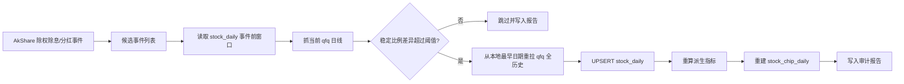

# A 股除权除息后的前复权日线刷新设计

## 背景

`stock_daily` 存的是正式 A 股日线，并且当前图表、筹码、规则实测和规则回测都以它作为本地真源。A 股发生分红、送股、转增、配股等除权除息事件后，上游的前复权价格会重新计算历史 OHLC。此时本地数据库中事件前的旧前复权价格不一定缺行，但价格口径已经过期。

这类问题不能在 Web 图表或回测层兜底，因为后续 MA、MACD、涨跌幅、筹码成本和规则命中都会被同一批旧价格污染。根治点必须在 `stock_daily` 数据层。

## 设计目标

- 自动发现近期除权除息候选股票。
- 不只依赖事件公告，必须用当前 qfq 源和数据库做价格差异确认。
- 只刷新确认 stale 的股票，避免误刷全市场。
- 一旦确认触发，从本地数据库最早日期开始全历史重拉并覆盖。
- 覆盖 `stock_daily` 后重算派生指标，并重建 `stock_chip_daily`。
- apply 前备份 SQLite，dry-run 默认不写库。
- 每次运行输出 JSON 审计报告，记录候选、差异、刷新结果和备份路径。

## 数据流



## 触发判定

工具：`tools/refresh_qfq_after_corporate_actions.py`

默认流程：

1. 读取公开除权除息/分红事件。
2. 默认每只股票只检查最新除权事件，避免同股多事件重复抓取；需要逐事件排查时加 `--check-all-events`。
3. 对每个候选股票，取事件日前 `--lookback-days` 的本地 `stock_daily`。
4. 用新浪 qfq 正式日线刷新同一窗口，失败时回退腾讯 qfq。
5. 按交易日对齐，比较本地收盘价 / 当前 qfq 收盘价。
6. 满足以下条件才判定触发：
   - 重叠交易日不少于 `--min-overlap`。
   - 收盘价中位比例差异不小于 `--min-ratio-diff`。
   - 收盘价比例全窗口标准差不超过 `--max-ratio-std`；如果窗口中存在少量日期已被局部刷新，则要求至少 `--min-ratio-consistency` 的日期落在同一个中位比例主簇内。

默认阈值：

- `--lookback-days 180`
- `--min-overlap 5`
- `--min-ratio-diff 0.02`
- `--max-ratio-std 0.035`
- `--min-ratio-consistency 0.8`

## 刷新策略

确认触发后，单只股票只刷新一次，即使同一周期内有多个事件。

刷新范围：

- 起点：数据库中该股票 `stock_daily` 的最早日期。
- 终点：命令传入的 `--end-date`。

写入行为：

- 使用现有 `DatabaseManager.save_daily_data()`，按 `(code, date)` UPSERT。
- OHLCV、涨跌幅、均线、量比等会按当前 qfq 数据覆盖。
- 市值、PE、股本等当前 qfq 源缺失的可选字段使用现有 coalesce 逻辑保留旧值。
- 写完后调用 `refresh_stock_daily_derived_metrics_from_db()` 重算规则派生指标。
- 默认调用 `sync_chip_daily_from_history(..., skip_existing=False)` 重建筹码日缓存。

## 使用方式

### 每日自动任务

服务启动后会自动注册 `qfq_corporate_action_refresh` 后台任务：

- `python main.py --schedule` 或 `SCHEDULE_ENABLED=true`：作为每日调度器的后台任务运行。
- `python main.py --serve-only`、`python main.py --serve` 或直接启动 FastAPI：随 API 生命周期启动后台 worker。

默认行为：

- 每 30 分钟检查一次是否满足运行条件。
- 只在 A 股交易日执行。
- 只在 `16:30` 之后执行。
- 同一交易日成功完成后会写入本地状态文件，服务重启后也不会重复执行；如果刷新过程出现失败或 partial，会在下一轮继续重试。
- 每次扫描最近 60 个自然日的除权除息/分红事件。
- 确认触发后自动 `apply`，从该股票本地最早日线重拉 qfq 覆盖 `stock_daily`，并重建 `stock_chip_daily`。

可通过 `.env` 调整：

```env
QFQ_CORPORATE_ACTION_REFRESH_ENABLED=true
QFQ_CORPORATE_ACTION_REFRESH_AFTER=16:30
QFQ_CORPORATE_ACTION_REFRESH_LOOKBACK_DAYS=60
QFQ_CORPORATE_ACTION_REFRESH_INTERVAL_SECONDS=1800
```

自动任务报告目录：

```text
outputs/qfq_corporate_action_refresh/scheduled/
```

同目录下的 `qfq_corporate_action_refresh_state.json` 会记录最近一次成功完成的交易日，用于避免服务重启后当天重复扫描。

如果不希望自动修复前复权历史，把 `QFQ_CORPORATE_ACTION_REFRESH_ENABLED=false` 写入 `.env` 即可；手动工具仍可继续使用。

自动任务和分钟热表收盘归档是两个独立后台任务：分钟热表归档负责把盘中临时行情替换为正式日线，除权除息 qfq 刷新负责修正已存在历史日线的复权口径。即使当天没有跑股票分析，只要服务或每日调度进程在运行，数据层也会在收盘后自检。

### 手动使用

只看单股是否会触发：

```bash
python tools/refresh_qfq_after_corporate_actions.py \
  --event-start-date 2026-01-01 \
  --end-date 2026-06-05 \
  --codes 688498
```

确认后刷新单股：

```bash
python tools/refresh_qfq_after_corporate_actions.py \
  --event-start-date 2026-01-01 \
  --end-date 2026-06-05 \
  --codes 688498 \
  --apply
```

扫描全市场最近两年事件并刷新触发股票：

```bash
python tools/refresh_qfq_after_corporate_actions.py \
  --event-start-date 2024-06-06 \
  --end-date 2026-06-05 \
  --apply
```

如果已经有 dry-run 报告，可直接复用报告里的触发清单执行刷新，避免重复逐股 qfq 对比：

```bash
python tools/refresh_qfq_after_corporate_actions.py \
  --apply \
  --apply-from-report outputs/qfq_corporate_action_refresh/qfq_corporate_action_refresh_<timestamp>.json
```

如果只想先刷新日线和派生指标、暂时跳过筹码重建：

```bash
python tools/refresh_qfq_after_corporate_actions.py \
  --event-start-date 2024-06-06 \
  --end-date 2026-06-05 \
  --apply \
  --skip-chip
```

## 审计产物

默认输出目录：

```text
outputs/qfq_corporate_action_refresh/
```

包含：

- `qfq_corporate_action_refresh_*.json`：dry-run 或 apply 报告。
- `stock_analysis.db.bak.*.qfq`：apply 前 SQLite 备份。

报告关键字段：

- `event_count`：扫描到的候选事件数。
- `checked_event_count`：实际执行 qfq 差异确认的事件数，默认等于有事件股票数。
- `candidate_status_counts`：候选判定状态分布。
- `triggered_codes`：确认触发刷新的股票。
- `candidates[].median_close_ratio`：本地旧价 / 当前 qfq 价的中位比例。
- `candidates[].close_ratio_std`：全窗口比例标准差。
- `candidates[].close_ratio_consistency`：落在中位复权比例主簇内的日期占比。
- `apply_results[]`：每只股票抓取、覆盖、派生指标和筹码重建结果。

## 回滚

如果 apply 后发现异常，停止服务后用报告中的备份恢复 SQLite：

```bash
cp outputs/qfq_corporate_action_refresh/stock_analysis.db.bak.<timestamp>.qfq data/stock_analysis.db
```

如果服务运行在 WAL 模式，恢复前同时停止写入进程，并删除旧的 `data/stock_analysis.db-wal` 与 `data/stock_analysis.db-shm`，再重启服务。
