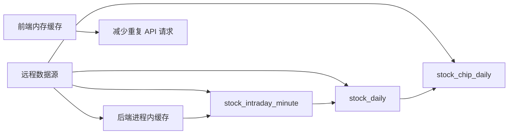
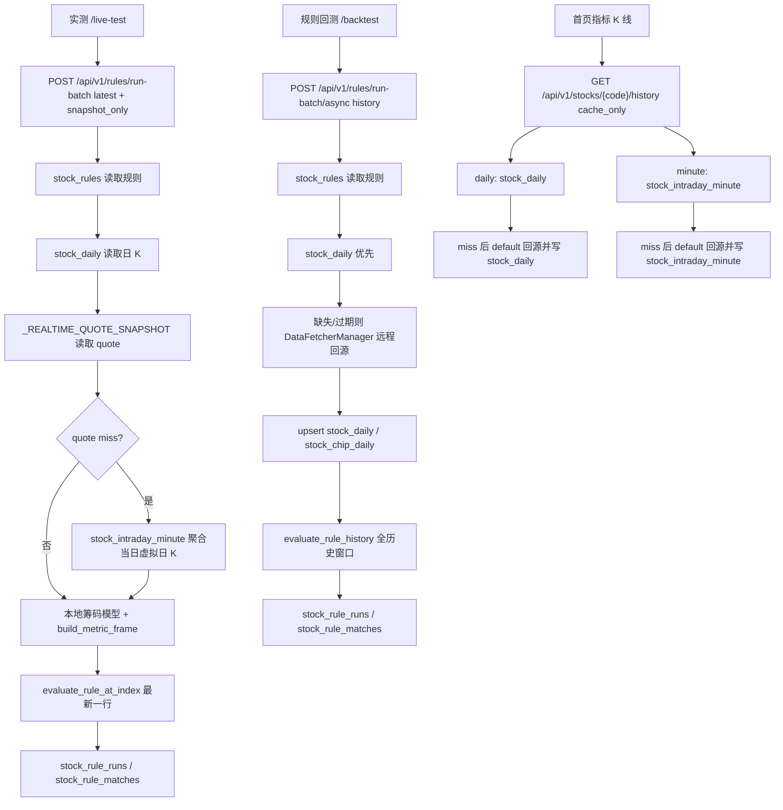

# 实测、回测与首页 K 线数据获取链路

本文梳理当前代码中三条核心数据链路：

- Web「实测」页：`/live-test`，实时规则扫描。
- Web「回测」页：`/backtest`，规则历史扫描。
- 首页「指标」入口后的 K 线：`/indicators/:stockCode`，从首页自选列表进入。

另有一套后端「AI 分析记录回测」接口在 `/api/v1/backtest/*`，它不是 Web「回测」页当前使用的规则回测链路，但也是后端回测能力的一部分，本文单独列出，避免概念混淆。

## 关键入口

| 功能 | 前端入口 | API 入口 | 后端主链路 |
| --- | --- | --- | --- |
| 实测 | `apps/dsa-web/src/pages/BacktestPage.tsx`，`mode="live"` | `POST /api/v1/rules/run-batch` | `api/v1/endpoints/rules.py` -> `RuleService.run_rules` |
| Web 规则回测 | `apps/dsa-web/src/pages/BacktestPage.tsx`，默认 `mode="backtest"` | `POST /api/v1/rules/run-batch/async` | `api/v1/endpoints/rules.py` -> `RuleService.start_run_rules` -> 后台 `complete_started_run_rules` |
| AI 分析记录回测 | CLI、每日分析后自动触发、`/api/v1/backtest/*` | `POST /api/v1/backtest/run` | `api/v1/endpoints/backtest.py` -> `BacktestService.run_backtest` |
| 首页 K 线 | 首页自选列表「指标」按钮 -> `/indicators/:stockCode` | `GET /api/v1/stocks/{code}/history` | `api/v1/endpoints/stocks.py` -> `StockService.get_history_data` |

## 共享缓存与数据库层

项目里和这三条链路相关的“缓存”分三类：

1. 前端内存缓存：只减少页面内重复请求，刷新页面后失效，不和数据库同步。
2. 后端进程内缓存：只存在于当前 Python 进程，主要用于实时 quote、数据源全市场 DataFrame、股票名称、基本面上下文；进程重启后失效。
3. 数据库缓存表：`stock_daily`、`stock_intraday_minute`、`stock_chip_daily` 是持久化缓存，也是回测、实测和首页 K 线真正可复用的数据层。

### 缓存使用时机总表

| 缓存层 | 代码位置 | 缓存内容 | 使用时机 | 是否同步数据库 | 缓存 miss 时怎么办 |
| --- | --- | --- | --- | --- | --- |
| 首页 quote 前端缓存 | `apps/dsa-web/src/pages/HomePage.tsx` 的 `quoteCacheRef` | 自选股/全 A 股 quote，TTL 30 秒 | 首页加载自选股行情、切换到全 A 股列表、返回列表时先复用 | 否 | 只对缺失代码调用 `POST /api/v1/stocks/quotes`；返回后重新写入前端缓存 |
| 指标页 K 线前端缓存 | `IndicatorAnalysisView` 的 `historyCache` | 当前股票按周期分开的 K 线、quote、指标扩展数据 | 打开指标页、切换周期、1m/分时定时刷新 | 否 | 先调后端 `cache_only`；日线返回 `daily_cache_miss` 或分钟返回 `intraday_hot_table_miss` 时，实时模式再调 `default` 回源；历史模式只调 `db_only` |
| 回测/实测页面运行态缓存 | `BacktestPage.tsx` 的 `backtestRuntimeStates` | 当前页面 tab 的运行状态、结果、轮询信息 | 页面切换或组件重渲染时恢复 UI 状态 | 否 | 重新从 `stock_rule_runs`、`stock_rule_matches` 等 API 读取，或等待新运行返回 |
| 实时 quote 快照 | `src/services/stock_service.py` 的 `_REALTIME_QUOTE_SNAPSHOT` | 一轮预热产生的全 A 股 quote 快照，含 `snapshot_id` | 实测 `snapshot_only`、首页/指标页 `cache_only` quote、`default` quote 的第一优先级 | 间接同步：生成快照时同批 quote 会写 `stock_intraday_minute` | quote API 的 `snapshot_only/db_only` 直接返回空；规则实测会继续尝试本地分钟热表 fallback；`cache_only` 继续查短缓存；`default` 继续查短缓存和远程数据源 |
| 实时 quote 短缓存 | `src/services/stock_service.py` 的 `_REALTIME_QUOTE_CACHE` | 单股 quote payload，按 `REALTIME_QUOTE_CACHE_SECONDS` 时间桶复用 | `get_realtime_quote(s)` 在快照未命中后读取；预热任务也用它判断本轮缺失代码 | 只有 `warm_realtime_quotes()` 会把当前批次 quote 样本写入 `stock_intraday_minute`；普通按需 quote 不直接落库 | `cache_only` 返回空；`default` 调 `DataFetcherManager.get_realtime_quote(s)` 远程回源，成功后写短缓存 |
| 数据源全市场实时缓存 | `data_provider/efinance_fetcher.py`、`data_provider/akshare_fetcher.py` 的 `_realtime_cache`、`_etf_realtime_cache` | efinance/AkShare 全市场股票或 ETF DataFrame，TTL 同 `REALTIME_QUOTE_CACHE_SECONDS` | 数据源单股实时、批量实时、市场统计都会先查这个 DataFrame | 不直接同步 DB；只有上层 `StockService.warm_realtime_quotes()` 使用这些数据形成 quote payload 后才会写 `stock_intraday_minute` | miss 时在锁内拉全市场接口并更新 DataFrame；AkShare 失败时会缓存空 DataFrame，避免同一 TTL 内反复打接口 |
| 日线数据库缓存 | `stock_daily` 表 | 日 K、估值、成交额、换手、均线等字段 | 规则实测、规则回测、AI 回测、首页指标日 K 都优先读 | 是，远程日线成功后 upsert；分钟热表收盘归档后也 upsert | `cache_only/snapshot_only` 返回 `daily_cache_miss`；`db_only` 可返回部分历史；`default` 远程回源，失败且有旧缓存时降级用旧 DB 数据 |
| 分钟热表 | `stock_intraday_minute` 表 | 当日或近几日分钟 K/quote 采样，含 `snapshot_id`、`snapshot_time` | 首页指标分钟 K、1m/分时刷新、规则实测快照 miss fallback、收盘归档、诊断接口 | 是，预热 quote 采样和按需分钟 K 回源都会写入；收盘任务再聚合写 `stock_daily` | `cache_only/snapshot_only/db_only` 返回 `intraday_hot_table_miss`；规则实测会把命中的 1m 热表聚合成当日虚拟日 K；`default` 调远程分钟 K，成功后写热表并重读 |
| 筹码日缓存 | `stock_chip_daily` 表 | 筹码峰快照、获利盘、平均成本、集中度、分布 JSON | 指标扩展、规则指标帧、首页指标页 `getIndicatorMetrics` | 是，日线写入后会从历史同步；远程/本地筹码成功后也写入 | `cache_only/db_only/snapshot_only` 返回空指标并带 `chip_daily_miss`；`default` 调筹码数据源或本地模型，成功后写表 |
| 股票名称缓存 | `DataFetcherManager._stock_name_cache`、部分 fetcher 内部 `_stock_name_cache` | 股票代码到名称 | 报告、规则、指标、历史响应需要展示名称时 | 否 | 先查本地映射和 `stocks.index.json`，再按需查实时 quote 或各 fetcher；都失败返回空字符串 |
| 股票索引文件缓存 | `src/data/stock_index_loader.py` 的 `_STOCK_INDEX_CACHE`、`_ALL_A_SHARE_CODES_CACHE` | 从 `stocks.index.json` 加载的名称索引和活跃 A 股代码列表 | 后端名称解析、全 A 股预热目标列表 | 否 | 文件不存在或解析失败时缓存空 map/list；预热会因目标为空跳过 |
| 基本面上下文缓存 | `DataFetcherManager._fundamental_cache` | 估值、成长、业绩、机构、资金流、龙虎榜、板块等聚合上下文 | 主分析 pipeline 需要基本面上下文时，按 `FUNDAMENTAL_CACHE_TTL_SECONDS` 复用 | 否 | miss 时按预算依次拉各基本面数据源；成功且结果可缓存时写回进程内缓存 |
| 长桥静态信息缓存 | `LongbridgeFetcher._static_cache` | `static_info` 返回的名称、股本、EPS/BPS 等静态信息 | 长桥 quote/name/估值字段补充 | 否 | TTL 过期或 miss 时重新请求 Longbridge；失败只影响该 provider 的补充字段 |

### 数据策略和 miss 规则

`StockService` 和规则服务共同使用四种 `data_policy`：

| 策略 | quote 行为 | 日线行为 | 分钟 K 行为 | 典型调用 |
| --- | --- | --- | --- | --- |
| `default` | 快照 -> 短缓存 -> 远程数据源，成功后写短缓存 | 先读 `stock_daily`；不足或过期时远程拉日线，成功后写 `stock_daily` 并同步 `stock_chip_daily`；远程失败且有旧缓存时用旧缓存兜底 | 先读 `stock_intraday_minute`；miss 后远程拉分钟 K，成功后写热表并重读 | 规则回测、首页指标页实时模式 cache miss 后补齐 |
| `cache_only` | 只读快照和短缓存，不远程 | 只读 `stock_daily`，miss 返回 `daily_cache_miss` | 只读 `stock_intraday_minute`，miss 返回 `intraday_hot_table_miss` | 指标页首次快速加载、首页 quote 轻刷新 |
| `snapshot_only` | quote API 只读 `_REALTIME_QUOTE_SNAPSHOT`，不读短缓存，不远程；规则实测在 quote miss 时会本地读取 1m 热表聚合 fallback | 只读 `stock_daily`，可用快照 quote 或热表 fallback 生成虚拟当日点 | 只读分钟热表，可用快照 quote 校准最后一根 | 实测固定使用，确保不主动远程回源 |
| `db_only` | 不读实时缓存，不远程 | 只读 `stock_daily`，允许部分窗口，不追加实时点 | 只读 `stock_intraday_minute`，不追加实时点 | 历史态指标页、需要纯 DB 视角的页面或测试 |

关键结论：

- `cache_only` 和 `snapshot_only` 都不会主动远程回源，也不会补库。
- `default` 是唯一会在 miss 后主动访问远程行情源的策略。
- `db_only` 用于“只看已经落库的数据”，不会用实时 quote 修正 K 线。
- 实测固定使用 `snapshot_only`，不主动远程回源；实时快照缺单股时，规则层允许用本地 `stock_intraday_minute` 聚合成当日虚拟日 K 作为 fallback。

### 缓存和数据库同步时机

缓存和数据库之间没有通用的双向同步线程，主要是以下写入点：

| 触发时机 | 触发代码 | 写入/读取表 | 同步内容 |
| --- | --- | --- | --- |
| FastAPI 启动后台预热 | `api/app.py` -> `RealtimeQuoteCacheWarmer.start()` | 写 `stock_intraday_minute` | 每 60 秒在 A 股交易时段预热全 A 股 quote；`warm_realtime_quotes()` 更新 `_REALTIME_QUOTE_CACHE` 和 `_REALTIME_QUOTE_SNAPSHOT`，并把同批 quote 样本写成分钟热表 |
| 手动或内部调用预热 | `StockService.warm_realtime_quotes()` | 写 `stock_intraday_minute` | 若短缓存全命中，也会用当前缓存重建快照并写一批样本；若有缺失，先远程补齐再写 |
| 首页/指标页日 K 默认回源 | `StockService.get_history_data(period="daily", data_policy="default")` | 读写 `stock_daily`，同步 `stock_chip_daily` | `stock_daily` miss/过期后拉远程日线，成功后 `save_daily_data()`，再从 DB 重读；同一日线帧会同步筹码日缓存 |
| 首页/指标页分钟 K 默认回源 | `StockService.get_history_data(period!="daily", data_policy="default")` | 读写 `stock_intraday_minute` | 热表 miss 后拉远程分钟 K，成功后 `save_intraday_minute_dataframe()`，再从热表重读 |
| 指标扩展默认回源 | `StockService.get_indicator_metrics(data_policy="default")` | 读写 `stock_chip_daily` | 远程筹码或本地模型成功后 `_save_chip_distribution_payload()` 写筹码日缓存 |
| 主分析 pipeline 拉日线 | `AnalysisPipeline._fetch_and_save_stock_data()` | 写 `stock_daily`，同步 `stock_chip_daily` | 每日分析抓取日线并保存；如果当天日线已存在则跳过远程，并确保目标日筹码日缓存存在 |
| AI 分析记录回测补数据 | `BacktestService._try_fill_daily_data()` | 写 `stock_daily` | AI 回测发现候选记录后，会尝试补齐分析日之后的评估窗口日线 |
| 收盘分钟热表归档 | `IntradayDailyArchiveWorker` 每 30 分钟运行 | `stock_intraday_minute` -> `stock_daily`，同步 `stock_chip_daily` | A 股交易日 16:00 后，把当日分钟热表聚合成日线；补估值字段；同步筹码日缓存；成功归档的代码会清理当日热表行 |
| 热表日常清理 | `StockService.warm_realtime_quotes()` | 清 `stock_intraday_minute` 旧行 | 预热后调用 `purge_intraday_minutes_older_than(3)` 清理 3 天前分钟热表 |

同步方向可以概括为：



说明：

- 后端进程内缓存不会在启动时从 DB 反向恢复。
- DB 表是持久层，服务重启后仍可被 `cache_only/snapshot_only/db_only` 读取。
- quote 快照写库只发生在预热路径；普通单股 quote 请求成功后只写 `_REALTIME_QUOTE_CACHE`，不会直接写 `stock_intraday_minute`。
- 规则实测使用分钟热表 fallback 时只读 `stock_intraday_minute` 并在内存中聚合，不会把聚合结果写入 `stock_daily`。
- 日线和分钟 K 的默认回源路径是写穿缓存：远程成功后先写 DB，再从 DB 重读返回。

### 数据库表

| 表 | ORM | 主要用途 |
| --- | --- | --- |
| `stock_daily` | `StockDaily` | 日 K 缓存；规则实测/规则回测/AI 回测/首页日 K 都会读。远程日线刷新后 upsert 到这里。 |
| `stock_intraday_minute` | `StockIntradayMinute` | 当日分钟热表；后台 quote 预热采样和按需分钟 K 回源都会写入；首页指标页的 1m/分时/分钟 K 优先读它。 |
| `stock_chip_daily` | `StockChipDaily` | 筹码峰日缓存；指标扩展数据的 `cache_only/db_only` 会读，远程筹码或本地模型同步后会写。 |
| `stock_rules` | `StockRule` | 用户配置的规则定义、目标范围、lookback。 |
| `stock_rule_runs` | `StockRuleRun` | 规则实测/规则回测运行记录、状态、进度、错误和汇总命中数。 |
| `stock_rule_matches` | `StockRuleMatch` | 规则命中明细，保存匹配股票、指标快照、命中事件和解释文本。 |
| `analysis_history` | `AnalysisHistory` | AI 股票分析历史；AI 分析记录回测从这里取候选记录。 |
| `backtest_results` | `BacktestResult` | AI 分析记录回测逐条评估结果。 |
| `backtest_summaries` | `BacktestSummary` | AI 分析记录回测的整体/单股汇总指标。 |

## Web 实测数据链路

### 前端触发

入口是 `/live-test`，由 `apps/dsa-web/src/App.tsx` 渲染 `BacktestPage mode="live"`。

页面加载时会并行获取：

1. `GET /api/v1/rules/metrics`：规则指标注册表。
2. `GET /api/v1/rules`：规则列表，后端读 `stock_rules` 并附带最近运行摘要。
3. 系统配置：用于读取 `STOCK_LIST` 等自选股配置。
4. `GET /api/v1/history`：用于在配置自选为空时补充最近分析过的股票。
5. 前端本地 `stocks.index.json`：用于 A 股全量/行业目标范围。

点击「运行实测」后：

1. 前端先用上海时间判断 A 股是否仍允许实测：交易日 15:00 及以前可运行，9:30 前和午休不再拦截。
2. 创建一个临时运行记录，首轮立即触发，之后每 30 秒触发一次。
3. 最多允许 2 个实测周期并发，超出会排队到下一个 slot。
4. 每轮调用：

```http
POST /api/v1/rules/run-batch
{
  "rule_ids": [1, 2],
  "mode": "latest",
  "data_policy": "snapshot_only",
  "target": {
    "scope": "custom",
    "stock_codes": ["600519", "300750"]
  }
}
```

5. 返回后前端按 `snapshot_id` 去重；相同快照不重复汇总，旧快照不覆盖新快照。
6. 若本轮有命中，前端继续调用 `POST /api/v1/rules/runs/{run_id}/notify` 推送通知。

### 后端规则准备

`api/v1/endpoints/rules.py` 接收请求后进入 `RuleService.run_rules()`：

1. 校验 `mode` 只能是 `latest/history`，实测固定为 `latest`。
2. 校验 `data_policy`，实测固定为 `snapshot_only`。
3. 通过 `RuleRepository.get_rule()` 从 `stock_rules` 读取规则定义。
4. `validate_definition()` 校验第一版规则只支持 `daily` 周期、至少一个条件组、目标范围合法、指标 key/operator 合法。
5. 目标股票优先使用前端传入的 `target.stock_codes`；没有显式代码时，`watchlist` 从 `STOCK_LIST` 取。
6. `_validate_live_snapshot_session()` 如果目标全部是 A 股，会再次校验实测时间窗口：交易日 15:00 及以前可运行，15:00 之后或非交易日返回错误。
7. `RuleRepository.create_run()` 写入 `stock_rule_runs`，初始状态为 `running`。

### 单股数据获取

每只股票最终进入 `RuleService._evaluate_stock()`：

1. 计算 `lookback_days`，默认来自规则定义 `lookback_days`，常见为 120。
2. 调用 `StockService.get_history_data(stock_code, period="daily", days=lookback_days, data_policy="snapshot_only")`。
3. 日线读取只走 DB：
   - `_load_daily_history_from_db(require_fresh=True, allow_partial=False)`。
   - 读取 `stock_daily`，使用原始代码、标准化代码、带交易所后缀代码等候选 key。
   - 要求缓存覆盖最新有效交易日，且行数满足请求窗口。
   - 命中返回 `data_source="db_cache"`。
   - 未命中返回空数组和 `data_source="daily_cache_miss"`，不远程回源。
4. 如果日线为空，规则层抛出 `RuleDataUnavailable("history_cache_miss")`，外层按“数据暂不可用”记录日志并跳过该股票，不写入命中，也不计入硬错误。
5. 读取实时 quote：
   - `StockService.get_realtime_quote(data_policy="snapshot_only")`。
   - 只查 `_REALTIME_QUOTE_SNAPSHOT.items_by_code`。
   - 未命中直接返回 `None`，不读短缓存，不访问远程数据源。
6. 如果 quote 为空，规则层会尝试本地分钟热表 fallback：
   - 调用 `StockService.get_history_data(stock_code, period="1m", days=1, data_policy="snapshot_only")`。
   - 只读取 `stock_intraday_minute`，不会远程回源。
   - 将同一交易日 1m 行聚合为 quote-like payload：`open=第一条 open`、`high=max(high)`、`low=min(low)`、`close/current_price=最后一条 close`、`volume/amount=sum`、`turnover_rate/change_percent=最后一条非空值`。
   - fallback payload 会带 `snapshot_id`、`snapshot_time`、`quote_time` 和 `source="intraday_hot_table"`。
7. 如果快照和分钟热表都为空，抛出 `RuleDataUnavailable("quote_snapshot_miss")` 并跳过该股票。
8. 指标扩展：
   - `data_policy="snapshot_only"` 时，`RuleService._get_indicator_metrics()` 不走远程筹码源。
   - 它用已取得的日线 `history_rows` 调用本地筹码模型 `compute_chip_distribution_from_history()`，把筹码指标注入规则指标帧。
9. `_sync_latest_history_rows_with_quote()` 根据 `snapshot_time/quote_time/update_time` 解析判断日，把实时 quote 或分钟热表 fallback 合成为最新日线点：
   - 若 `stock_daily` 最后一日就是判断日，更新最后一行。
   - 若最后一日早于判断日，追加一条虚拟实时日 K。
   - 虚拟点带 `snapshot_id`、`snapshot_time`、`data_source`；分钟热表 fallback 的 `data_source` 为 `intraday_hot_table`。
10. `build_metric_frame()` 把日线、quote 和筹码指标合成指标 DataFrame，计算 MA、MACD、RSI、前 N 日收益、成交量均线、资金流估算等规则可用字段。
11. `evaluate_rule_at_index()` 只评估最后一行。

### 结果落库与展示

1. 命中的股票会生成 `matched_events`、`matched_dates`、`snapshot` 和解释文本。
2. `RuleRepository.finish_run()` 更新 `stock_rule_runs`：
   - `status`：`completed` 或 `partial`。
   - `match_count`、`finished_at`、`duration_ms`、`error`。
3. 同时向 `stock_rule_matches` 写入每只命中股票：
   - `run_id`、`rule_id`、`stock_code`、`stock_name`。
   - `matched_groups_json`：命中的条件组。
   - `snapshot_json`：指标快照，并附 `_matched_dates`、`_matched_events`。
   - `explanation`：命中解释。
4. API 直接把本轮 matches 返回给前端。
5. 前端按执行时间折叠展示；通知接口再从 `stock_rule_matches` 读取命中明细并发送。

## Web 规则回测数据链路

Web「回测」页当前是规则历史扫描，不是 AI 分析记录回测。

### 前端触发

入口是 `/backtest`，默认渲染 `BacktestPage mode="backtest"`。

页面加载时比实测多一步：`GET /api/v1/rules/runs?limit=30` 读取历史运行记录，并在选中记录时调用 `GET /api/v1/rules/runs/{run_id}/matches` 读取 `stock_rule_matches`。

点击「运行回测」后，前端调用：

```http
POST /api/v1/rules/run-batch/async
{
  "rule_ids": [1, 2],
  "mode": "history",
  "target": {
    "scope": "custom",
    "stock_codes": ["600519", "300750"]
  },
  "start_date": "2026-01-01",
  "end_date": "2026-05-01"
}
```

前端随后每 5 秒轮询：

- `GET /api/v1/rules/runs/{run_id}`：读运行状态和进度。
- 完成后 `GET /api/v1/rules/runs/{run_id}/matches`：读命中明细。

### 后端启动与进度

`RuleService.start_run_rules()` 做的事情：

1. 校验规则、目标和日期范围。
2. 准备规则定义与目标股票。
3. `RuleRepository.create_run()` 写 `stock_rule_runs`，状态为 `running`。
4. 把多规则元数据编码进 `stock_rule_runs.error`：
   - `rule_ids`
   - `rule_names`
   - `errors`
   - `completed_count`
5. FastAPI `BackgroundTasks` 调用 `complete_started_run_rules()`。

后台执行时：

1. `_execute_batch_scan_by_stock()` 按股票并发，worker 数取 `MAX_WORKERS` 与目标数量的较小值。
2. 每完成一只股票就调用 `RuleRepository.update_run_progress()` 更新 `completed_count`。
3. 单股错误会记录成 `#{rule_id}:{stock_code}:{ExceptionName}`，不会中断整个批次。

### 历史日线数据获取

每只股票仍进入 `RuleService._evaluate_stock()`，但此时 `mode="history"`、`data_policy="default"`：

1. 先读日线 DB 缓存：
   - `StockService._load_daily_history_from_db(require_fresh=True)` 读取 `stock_daily`。
   - 命中且新鲜，直接返回 `data_source="db_cache"`。
2. 若 DB 不足或过期，允许远程回源：
   - 如果已有足够旧缓存但缺最新交易日，尝试从 `latest_cached_date + 1` 增量补齐到目标交易日。
   - 否则按完整窗口拉取。
3. 远程拉取通过 `DataFetcherManager.get_daily_data()`：
   - 美股/美股指数走专用路由：`YfinanceFetcher`、`LongbridgeFetcher`，美股个股还可能用 `EfinanceFetcher`、`AkshareFetcher` 兜底。
   - 其他市场按 fetcher 优先级循环尝试；Tushare 有 token 时可能提前，常见数据源包括 `EfinanceFetcher`、`AkshareFetcher`、`TushareFetcher`、`PytdxFetcher`、`BaostockFetcher`、`YfinanceFetcher`、`LongbridgeFetcher`。
   - 每个 fetcher 失败会记录错误摘要，然后切换下一个。
   - 全部失败时抛 `DataFetchError`。
4. 远程成功后：
   - `enrich_daily_history_with_quote_fields()` 尝试用实时 quote 补充估值、换手、市值等字段。
   - `StockRepository.save_dataframe()` -> `DatabaseManager.save_daily_data()` upsert 到 `stock_daily`。
   - `_sync_chip_daily_cache_from_history()` 根据日线同步 `stock_chip_daily`。
   - 再从 `stock_daily` 重新读取，保证返回值与 DB 落库口径一致。
5. 如果远程刷新失败但存在旧 DB 缓存，当前逻辑会降级使用过期 `stock_daily`，并记录 warning。

### 历史指标与规则评估

1. `RuleService._get_indicator_metrics()` 在 `mode="history"` 下先尝试基于历史日线构建本地筹码模型。
2. 如果本地筹码模型返回 `chip_distribution`，直接用于规则指标，不远程拉筹码。
3. 如果本地筹码不可用，会调用 `StockService.get_indicator_metrics(default)`：
   - `DataFetcherManager.get_chip_distribution()` 按筹码数据源优先级尝试，带熔断器。
   - 成功后 `_save_chip_distribution_payload()` 写 `stock_chip_daily`。
   - 资金流、主力/机构持仓也会尝试获取，但规则指标帧主要消费筹码分布与日线/quote 衍生字段。
4. `build_metric_frame()` 生成指标帧。
5. `evaluate_rule_history()` 对所有行逐日评估规则。
6. `_evaluate_history_events()` 过滤日期：
   - 有 `start_date/end_date` 时按用户范围过滤。
   - 未传 `start_date` 时，用 `lookback_days` 形成默认 cutoff。

### 结果落库与查询

与实测相同，最终落到：

- `stock_rule_runs`：运行状态、进度、错误、命中数量。
- `stock_rule_matches`：每只命中股票的事件、快照和解释。

差异是：

- 回测使用异步后台任务。
- 前端轮询 `stock_rule_runs` 进度。
- 完成后再读取 `stock_rule_matches`。
- 命中事件通常是多个历史交易日，而实测通常是一轮快照对应一个判断日。

## 后端 AI 分析记录回测链路

这条链路的入口是：

- CLI：`python main.py --backtest`
- API：`POST /api/v1/backtest/run`
- 每日分析完成后：如果 `BACKTEST_ENABLED=true`，`main.py` 自动调用一次，失败只记录 warning，不影响分析推送。

### 候选分析记录

`BacktestService.run_backtest()` 先调用 `BacktestRepository.get_candidates()`：

1. 从 `analysis_history` 选择 `created_at <= now - BACKTEST_MIN_AGE_DAYS` 的记录。
2. 可按 `code` 过滤。
3. 如果 `force=false`，排除同一 `analysis_history_id + eval_window_days + engine_version` 已存在于 `backtest_results` 的记录。
4. 按 `created_at desc` 限制 `limit`。

### 前向日线数据

每条 `analysis_history`：

1. `_resolve_analysis_date()` 优先从 `context_snapshot.enhanced_context.date` 解析分析日期；没有则使用 `created_at.date()`。
2. `StockRepository.get_start_daily()` 从 `stock_daily` 取 `date <= analysis_date` 的最近一条，作为起始价格。
3. 如果起始日线缺失或 `close` 为空，调用 `_try_fill_daily_data()`：
   - `DataFetcherManager.get_daily_data(start_date=analysis_date, end_date=analysis_date + max(eval_window_days * 2, 30))`
   - 成功后 `DatabaseManager.save_daily_data()` 写入 `stock_daily`。
   - 失败只 warning，不直接抛出。
4. `StockRepository.get_forward_bars()` 从 `stock_daily` 取 `date > start_daily.date` 的后续 N 根日线。
5. 如果 forward bars 不足，再尝试 `_try_fill_daily_data()`。
6. 仍不足时生成 `eval_status="insufficient_data"`。

### 评估与汇总

`BacktestEngine.evaluate_single()` 使用：

- `analysis_history.operation_advice`
- `analysis_history.stop_loss`
- `analysis_history.take_profit`
- 起始价 `start_daily.close`
- 后续 N 根 `stock_daily` 日 K

计算：

- `position_recommendation`
- `direction_expected`
- `direction_correct`
- `outcome`
- `stock_return_pct`
- 止盈/止损命中
- 模拟入场/退出收益

结果批量写入 `backtest_results`；如果 `force=true`，先删除同窗口/同版本旧结果。保存成功后 `_recompute_summaries()` 从 `backtest_results` 重新计算：

- `scope="overall"`，`code="__overall__"`。
- `scope="stock"`，逐个 touched code。

汇总写入 `backtest_summaries`。

查询接口：

- `GET /api/v1/backtest/results`：读 `backtest_results`，并 join `analysis_history` 返回股票名和历史趋势预测。
- `GET /api/v1/backtest/performance`：读 `backtest_summaries` 或按日期过滤动态聚合。
- `GET /api/v1/backtest/performance/{code}`：同上，但限定单股。

## 首页 K 线数据链路

### 从首页进入指标页

首页自选列表的「指标」按钮在 `HomePage.tsx` 中调用：

```ts
navigate(`/indicators/${encodeURIComponent(item.stockCode)}?name=...&price=...&changePct=...`)
```

`IndicatorAnalysisPage.tsx` 读取路由参数后渲染 `IndicatorAnalysisView`。

指标页的周期配置：

| 前端周期 | 请求 period | days |
| --- | --- | --- |
| 分时 | `1m` | 1 |
| 日K | `daily` | 120 |
| 1分 | `1m` | 3 |
| 5分 | `5m` | 3 |
| 15分 | `15m` | 30 |
| 30分 | `30m` | 30 |
| 60分 | `60m` | 30 |

### 初始日 K 加载

`IndicatorAnalysisView` 初始加载会并行执行：

1. `GET /api/v1/stocks/{code}/history?period=daily&days=120&data_policy=cache_only`
2. `GET /api/v1/stocks/{code}/quote?data_policy=cache_only`
3. `GET /api/v1/stocks/{code}/indicator-metrics`

如果第 1 步返回 `data_source="daily_cache_miss"`，前端会再请求：

```http
GET /api/v1/stocks/{code}/history?period=daily&days=120&data_policy=default
```

### 日 K 后端流程

`StockService.get_history_data(period="daily")`：

1. `cache_only` 或 `default` 都先读 `stock_daily`：
   - `_load_daily_history_from_db()` 根据最新有效交易日计算查询窗口。
   - 命中返回 `db_cache`。
2. `cache_only` 缺失：
   - 直接返回空数据和 `daily_cache_miss`。
   - 不访问远程数据源。
3. `default` 缺失或过期：
   - 通过 `DataFetcherManager.get_daily_data()` 远程拉取。
   - 成功后补充 quote 字段，upsert `stock_daily`。
   - 同步 `stock_chip_daily`。
   - 再从 DB 读取并返回。
4. 非 `db_only` 的日 K 返回前会调用 `_augment_daily_history_with_realtime()`：
   - `cache_only` 下只用 `snapshot_only` quote。
   - `default` 下可用默认 quote 链路。
   - 如果 quote 有有效实时信号，会更新最后一根日 K 或追加一根虚拟当日点。
   - 该虚拟点只用于响应，不写入 `stock_daily`。

### 分钟 K / 分时后端流程

选择分时、1分、5分、15分、30分、60分时：

1. 前端先请求 `data_policy=cache_only`。
2. 后端先读 `stock_intraday_minute`：
   - `DatabaseManager.get_intraday_minute_data(code, days, period, trade_date)`。
   - `1m` 直接返回分钟行。
   - `5m/15m/30m/60m` 使用 pandas resample 聚合。
   - A 股 6 位代码会过滤到 09:30-15:00 常规交易分钟。
3. 命中返回 `data_source="intraday_hot_table"`。
4. `cache_only` 未命中返回：

```json
{
  "data": [],
  "data_source": "intraday_hot_table_miss"
}
```

5. 前端看到 `intraday_hot_table_miss` 会用同一周期再请求 `data_policy=default`，不会降级展示日 K。
6. `default` 下后端调用 `DataFetcherManager.get_intraday_data()`：
   - 只尝试 `supports_intraday_data=True` 的 fetcher。
   - 对 A 股/港股休市日会锚定最近有效交易日。
   - 全部失败时返回空数据，并记录失败摘要。
7. 远程分钟 K 成功后：
   - `save_intraday_minute_dataframe()` upsert 到 `stock_intraday_minute`。
   - 再从热表读取，尽量以热表口径返回。
8. 非 `db_only` 返回前还会 `_augment_intraday_history_with_realtime()`：
   - 用 quote 校准最后一根分钟 K 的 `close/high/low`。
   - `cache_only` 只读快照 quote；`default` 允许远程 quote。

### 前端实时刷新

指标页还有两类 10 秒刷新：

1. 当前周期是 `1m` 或「分时」：
   - 每 10 秒同时请求分钟历史和 `quote?data_policy=cache_only`。
   - 用 quote 同步最后一根分钟 K。
2. 当前周期不是 `1m/分时`：
   - 每 10 秒只请求 `quote?data_policy=cache_only`。
   - 用 quote 同步当前已加载周期的最后一根 K 线。

所有刷新都属于软增强：quote 刷新失败时保留上一份可用数据。

### 指标扩展数据

`GET /api/v1/stocks/{code}/indicator-metrics` 与 K 线并行加载：

1. `cache_only/db_only/snapshot_only`：读 `stock_chip_daily`，不远程回源。
2. `default`：尝试远程筹码、资金流、主力/机构持仓。
3. 筹码成功后写入 `stock_chip_daily`。
4. 单个扩展数据源失败不会影响 K 线接口；接口以 `errors` 和 `source_chain` 暴露降级信息。

## 数据源失败与降级语义

| 场景 | 行为 |
| --- | --- |
| 实测日线 DB miss | `history_cache_miss`，该股票跳过，不远程回源。 |
| 实测 quote 快照 miss | 不读短缓存、不远程回源；改读 `stock_intraday_minute` 当日 1m 热表并聚合成虚拟当日 K。热表也 miss 时才 `quote_snapshot_miss` 跳过。 |
| Web 规则回测日线 DB stale | 默认允许远程补齐；远程失败但有旧缓存时使用旧缓存兜底。 |
| 首页日 K `cache_only` miss | 返回 `daily_cache_miss`，前端再用 `default` 按需回源。 |
| 首页分钟 K `cache_only` miss | 返回 `intraday_hot_table_miss`，前端再用同周期 `default` 回源，不降级日 K。 |
| quote `cache_only` miss | 返回 404 或空 quote，前端保持已有数据。 |
| 指标扩展失败 | fail-open，K 线继续展示，扩展接口返回空结构和 errors。 |
| AI 回测 forward bars 不足 | 写 `backtest_results.eval_status="insufficient_data"`。 |

## 快速读图


